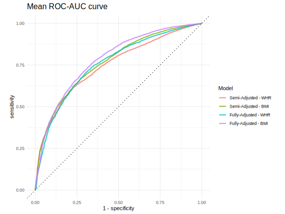

```{r, include = FALSE}
knitr::opts_chunk$set(
  collapse = TRUE,
  comment = "#>",
  fig.path = "man/figures/README-",
  out.width = "100%"
)
library(knitr)
library(kableExtra)
library(formattable)
```

As elaborated in our recent analyses (Walker et al. 2019; Scarpone et al. 2020), nearly all previous studies in the literature use either census unit boundaries or simple buffer zones to measure an individual’s built environment (BE) exposures or to characterize their local socioeconomic status (SES) (Rhew et al. 2011, Gong et al. 2014, Fuertes et al. 2014). Therefore, we present a distance-weighted, network-based model for quantifying the combined effects of local greenspace and SES on diabetes risk, from which we derive an area-based Diabetes Risk Index of Greenspace, Land Use and Socioeconomic Environments (DRI-GLUCoSE).\
The goal of the DRIGLUCoSE package is to provide a public package containing functions and code used in the development of the DRI-GLUCoSE Index.


# Installation

You can install the latest version of DRIGLUCoSE from [GitHub](https://CRAN.R-project.org) with:

```{r eval=FALSE, include=TRUE}
devtools::install_git("https://github.com/STBrinkmann/DRIGLUCoSE")
```


Once installed, the library can be loaded as follows:

```{r message=FALSE, warning=FALSE}
library(DRIGLUCoSE)
```


# Methods
One key purpose of this package is, to provide functions for route networked derived isochrones. For that purpose we have provided a sample sf object of 2 points in Erlangen, Germany.

```{r}
data(Erlangen)
Erlangen
```

## Census variables
In our analysis we acquired data of the Canadian census dissemination areas. It has been converted to a shapefile (sf) with one column per census variable. To demonstrate we use the following randomly generated data:

```{r message=FALSE, warning=FALSE}
set.seed(1234)
census <- sf::st_make_grid(
  # Use Sample Data and apply 25 minutes buffer (Speed[m/min] * 25[min]) 
  Erlangen %>% dplyr::mutate(geom = sf::st_buffer(geom, Speed*25)),
  cellsize = 100
  ) %>% 
  sf::st_as_sf() %>% 
  dplyr::mutate(census_var_a = sample(1:1000, n(), replace = TRUE),
                census_var_b = sample(1000:10000, n(), replace = TRUE),
                census_var_c = sample(100000:150000, n(), replace = TRUE)) %>% 
  dplyr::rename(geom = x)

census
```

## Greenspace
In our analysis we acquired LANDSAT images through the United States Geological Survey’s EarthExplorer platform (https://earthexplorer.usgs.gov/). The Normalized Difference Vegetation Index ([NDVI](https://gisgeography.com/ndvi-normalized-difference-vegetation-index/)) is used as a metric to model greenspace exposure. Pre-processing of the LANDSAT images and NDVI calculation has been conducted using the _LS_L1C_ function:

```{r message=FALSE, warning=FALSE}
DRIGLUCoSE::LS_L1C(l1c_path = "docs/LC08_L1TP_193026_20200423_20200508_01_T1_small/", 
                   out_dir = "docs/LS_PreProcessed",
                   # Use Sample Data and apply 25 minutes buffer (Speed[m/min] * 25[min]) 
                   sf_mask = DRIGLUCoSE::Erlangen %>% 
                     dplyr::mutate(geom = sf::st_buffer(geom, Speed*25)),
                   cores = 20)
```

## Exposure Model
In order to estimate each participant’s potential exposures to greenspace and local SES, we (i) mapped age- and sex-specific walkable zones around their residential address, and (ii) applied a negative logit weighting function, such that the estimated effect of greenspace or SES decreases as distance from the home increases.

### (i) Road network data and isochrones
In order to compute network-based distance metrics, we acquired street data from OpenStreetMap using the R-package _osmdata_ (Padgham et al. 2017). Road types not suitable for walking were removed (e.g., motorways). Network data were topologically corrected and split into ~20 metre-long segments using the R package _nngeo_ (Dorman 2020).

```{r message=FALSE, warning=FALSE}
erlangen.osm <- DRIGLUCoSE::osm_roads(x = Erlangen, dist = 20, 
                                      speed = "Speed", cores = 2)
```


This network data was used to derive walking distance buffers for each participant, based on walking speed. Starting from each participant’s place of residence, we computed network-constrained buffers with an off-road width of 40 meters, running in 2-minute increments from 0 to 20 minutes, using the A*-algorithm (Hart, Nilsson & Raphael 1968). This therefore resulted in each participant having ten concentric isochrones, the sizes of which are a function of individual walking speed and road network.\
Since the road network contains a lot of features (n=`r nrow(erlangen.osm)`), this will take some time (~15-30 minutes).

```{r eval=FALSE, message=FALSE, warning=FALSE}
erlangen.isodistances <- DRIGLUCoSE::isodistances(x = Erlangen, 
                                                  road_network = erlangen.osm, 
                                                  tag = "tag", speed = "Speed",
                                                  isochrones_seq = seq(2, 20, 2),
                                                  cores = 2)
```
```{r echo=FALSE, message=FALSE, warning=FALSE}
data(erlangen.isodistances)
```

```{r message=FALSE, warning=FALSE}
erlangen.isochrones <- DRIGLUCoSE::isochrones(x = erlangen.isodistances, 
                                              buffer = 40, cores = 2)
erlangen.isochrones
```


Figure 1 shows isodistances of the two points of the sample data in Erlangen, Germany.

```{r echo=FALSE, fig.height=7, fig.width=10, message=FALSE, warning=FALSE, dev='svg'}
isorings <- function(tag, isochrone) {
  this_isochrone <- isochrone[isochrone$tag == tag, ]
  isoch_rings <- this_isochrone[0,]
  
  for(i in 1:nrow(this_isochrone)) {
    if (i == 1) {
      isoch_rings[1,] <- this_isochrone[i,] # first isochrone
      } else {
        # create subsequent rings and add subsequent to sf
        isoch_rings <- sf::st_difference(this_isochrone[i,], this_isochrone[i-1,]) %>%
          dplyr::select(tag, time) %>% 
          dplyr::add_row(isoch_rings, .)
      }
  }
  return(isoch_rings)
}

erlangen.isorings <- lapply(c(1,2), FUN = isorings, erlangen.isodistances) %>% 
  DRIGLUCoSE::rbind_parallel()


erlangen.isorings %>%
  dplyr::mutate(time = time %>% as.character() %>% as.numeric()) %>% 
  tmap::tm_shape() +
  tmap::tm_lines(col = "time", lwd = 3, #style = "cont",
                 palette = "-viridis", n = 10,
                 title.col = "Walking-Distance\n(minutes)",
                 legend.col.is.portrait = T) +
  tmap::tm_facets(by = "tag") +
  tmap::tm_shape(Erlangen) + 
  tmap::tm_dots(col = "black", size = 0.6, shape = 20) +
  tmap::tm_facets(by = "tag") +
  tmap::tm_layout(legend.outside.position = "right",
                  legend.position = c(0.1, 0.4),
                  legend.outside.size = .15,
                  legend.title.size = 1.5,
                  legend.text.size = 1,
                  panel.show = F)
```

### (ii) Distance-weighting
In order to account for the diminishing effect of SES and greenspace exposure as distance increases, we fitted a logit function to weight each incremental isochrone, such that the influence of a variable decreases with increasing distance from the household, i.e., features that are farther away have less influence than nearby features, as illustrated in Figure 2. A logit function was selected as it heuristically approximates a suitable distance-decay function (Bauer and Groneberg 2016; Jia et al. 2019).\
The distance-weighting is separated in two parts, first the logit function (1) that is used for both SES and greenspace variables, and second the proportional weights function (4) that is only applied on SES variables.

$$
\begin{align*}
  G_t =
    \begin{cases}
      \cfrac{\int_0^{r_t} \, g(r)dr}{\int_0^{r_{t_{max}}} \, g(r)dr}, t=1\\
      \cfrac{\int_{r_{t-1}}^{r_t}  \, g(r)dr}{\int_0^{r_{t_{max}}} \, g(r)dr}, t>1
    \end{cases}
    && \text{(1)}
\end{align*}
$$

Each isochrone $t$ is assigned a distance weight $G_T$, calculated as the integral of the logistic distance decay function $g(r)$ (2)

$$
\begin{align*}
  g(r) =
    \cfrac{1}{1 + e^{ \,b \,(r-m)}}
    && \text{(2)}
\end{align*}
$$

with $b = 8$ and $m = 0.6$, in the interval between the mean inner radius $r_{t-1}$ and mean outer radius $r_t$ of the isochrone (e.g. 2 to 4 minutes isochrones), normalized by the integral from 0 to the outermost isochrone boundary $r_{t_{max}}$ (e.g. 20 minutes isochrone). Weighted summary statistics to describe the greenspace (e.g. mean or minimum NDVI) are thus described as (3)

$$
\begin{align*}
  \sum_t G_t \, f(NDVI_t \, \cap \, I_t)
    && \text{(3)}
\end{align*}
$$

For SES variables the proportional weights of the census areas within the isochrone are further defined as (4)

$$
\begin{align*}
  A_{tj} =
    \cfrac{A(C_j \, \cap \, I_t)}
    {A(I_t)}
    && \text{(4)}
\end{align*}
$$

with the proportion of the area of the intersection of the census area $C_j$ and the isochrone $I_t$, and the area of the isochrone $I_t$. The weighted value of the SES variable $x_i$ in the census area $j$ is then defined as (5)

$$
\begin{align*}
  \sum_t \left( \ G_t \ \sum_j \, x_{ij} \; A{tj} \right)
    && \text{(5)}
\end{align*}
$$

Figure 2 visualizes the different submodels used for distance-weighting SES and greenspace. Fig. 2a shows the unweighted values of a SES variable and fig. 2b has been calculated using (5), thus representing the proportional weights of all intersections with the census areas and isochrones. Greenspace is weighted as shown in fig. 2c using (3).

```{r fig2, echo=FALSE, fig.cap="Figure 2: Unweighted values (a) and network-based distance-weighting function for socioeconomic variables (b) and greenspace (c). Bold black lines indicate the isochrones.", out.width = '90%'}
knitr::include_graphics("docs/WeightsPlot.svg")
```
\
\
The distance-weighting for the LANDSAT derived NDVI raster (greenspace exposure) is handled using _LS_band_weighting_, and SES distance- and areal-weighting using _census_weighting_. 

```{r eval=TRUE, message=FALSE, warning=FALSE}
# Calculate sd, median, 5th percentile, 95th percentile and skew of NDVI values
NDVI_weighted <- 
  DRIGLUCoSE::LS_band_weighting(isochrones = erlangen.isochrones, tag = "tag",
                                landsat_list = dir("docs/LS_PreProcessed",
                                                   pattern = ".grd",
                                                   full.names = T) %>%
                                  lapply(raster::brick),
                                stats = list("sd", "median", 
                                             list("percentile", 0.05), 
                                             list("percentile", 0.95),
                                             "skew"), 
                                b = 8, m = 0.6)

NDVI_weighted
```

```{r eval=TRUE, echo=FALSE}
unlink("docs/LS_PreProcessed", recursive = T)
```


```{r eval=TRUE, message=FALSE, warning=FALSE}
census_weighted <- DRIGLUCoSE::census_weighting(isochrones = erlangen.isochrones, 
                                                tag = "tag", census = census, 
                                                b = 8, m = 0.6)
census_weighted
```


# Appendix

## Tables

```{r echo=FALSE, message=FALSE, warning=FALSE}
names_spaced <- c(
  "Parameter",
  "OR<br/>(bivariate)",
  "OR<br/>(WHR-adjusted)",
  "OR<br/>(BMI-adjusted)",
  "OR<br/>(WHR-adjusted)",
  "OR<br/>(BMI-adjusted)"
)

dplyr::tibble(
    Parameter = c(
      "DRI-GLUCoSE Score", "Age (5 year-interval)", "Sex: female",
      "Obese (WHR)", "BMI", "Household income range",
      "Neighbourhood type: urban", "AHEI Score (E^1)", "Physical Activity MET Score",
      "Current/Former smoker: yes", "Alcohol: <1 drink/day"
    ),
    "A" = c(
      "0.4 (0.3-0.54,<br/>p-value<0.001)", "1.27 (1.19-1.36,<br/>p-value<0.001)", 
      "0.61 (0.48-0.76,<br/>p-value<0.001)", "5.54 (4.24-7.33,<br/>p-value<0.001)", 
      "1.14 (1.12-1.16,<br/>p-value<0.001)", "0.74 (0.69-0.8,<br/>p-value<0.001)",
      "0.88 (0.67-1.16,<br/>p-value=0.385)", "0.76 (0.68-0.85,<br/>p-value<0.001)",
      "0.74 (0.63-0.88,<br/>p-value<0.001)", "1.66 (1.32-2.09,<br/>p-value<0.001)",
      "1.19 (0.92-1.54,<br/>p-value=0.184)"
    ),
    "B)"  = c(
      "0.55 (0.43-0.7,<br/>p-value<0.001)", "1.2 (1.14-1.26,<br/>p-value<0.001)",
      "0.89 (0.74-1.06,<br/>p-value=0.19)", "5.96 (4.97-7.16,<br/>p-value<0.001)",
      "", "0.87 (0.82-0.92,<br/>p-value<0.001)",
      "0.69 (0.56-0.86,<br/>p-value<0.001)", "",
      "", "",
      ""
    ),
    "C" = c(
      "0.59 (0.46-0.76,<br/>p-value<0.001)", "1.26 (1.2-1.32,<br/>p-value<0.001)",
      "0.46 (0.38-0.54,<br/>p-value<0.001)", "",
      "1.15 (1.13-1.17,<br/>p-value<0.001)", "0.85 (0.8-0.9,<br/>p-value<0.001)",
      "0.72 (0.58-0.9,<br/>p-value=0.003)", "",
      "", "",
      ""
    ),
    "D" = c(
      "0.5 (0.38-0.64,<br/>p-value<0.001)", "1.19 (1.13-1.26,<br/>p-value<0.001)",
      "0.83 (0.67-1.02,<br/>p-value=0.078)", "5.02 (4.08-6.19,<br/>p-value<0.001)",
      "", "0.84 (0.79-0.9,<br/>p-value<0.001)",
      "0.54 (0.42-0.69,<br/>p-value<0.001)", "0.87 (0.79-0.96,<br/>p-value=0.005)",
      "0.9 (0.78-1.03,<br/>p-value=0.134)", "1.43 (1.18-1.74,<br/>p-value<0.001)",
      "2.11 (1.69-2.64,<br/>p-value<0.001)"
    ),
    "E" = c(
      "0.57 (0.43-0.75,<br/>p-value<0.001)", "1.23 (1.17-1.3,<br/>p-value<0.001)",
      "0.43 (0.35-0.52,<br/>p-value<0.001)", "",
      "1.14 (1.12-1.16,<br/>p-value<0.001)", "0.82 (0.77-0.88,<br/>p-value<0.001)",
      "0.64 (0.5-0.82,<br/>p-value<0.001)", "0.92 (0.84-1.02,<br/>p-value=0.126)",
      "0.92 (0.8-1.06,<br/>p-value=0.272)", "1.27 (1.04-1.54,<br/>p-value=0.018)",
      "1.81 (1.45-2.26,<br/>p-value<0.001)"
    )
) %>% kbl(caption = "Table A.1: Logistic models for all multivariable models with odds ratios, 95% CI, and p-values.",
            format = "html", col.names = names_spaced, escape = FALSE, align=c("l", "c", "c", "c", "c", "c"),
            table.attr = "style='width:90%;'") %>% 
  kable_classic("striped") %>%
  add_header_above(c(" " = 2, "Semi-Adjusted" = 2, "Fully-Adjusted" = 2))
```
\

```{r echo=FALSE, message=FALSE, warning=FALSE}
names_spaced <- c(
  "Metric",
  "OR<br/>(WHR-adjusted)",
  "OR<br/>(BMI-adjusted)",
  "OR<br/>(WHR-adjusted)",
  "OR<br/>(BMI-adjusted)"
)

dplyr::tibble(
    Metric = c("Sensitivity", "Specificity", "Youden index"),
    "OR (WHR-adjusted)" = c(0.67, 0.71, 0.38),
    "OR (BMI-adjusted)"  = c(0.76, 0.64, 0.41),
    "OR (WHR-adjusted) " = c(0.69, 0.72, 0.41),
    "OR (BMI-adjusted) " = c(0.78, 0.66, 0.44)
) %>% kbl(caption = "Table A.2: Model Performance for all multivariable models.",
            format = "html", col.names = names_spaced, escape = FALSE, align=c("l", "c", "c", "c"),
            table.attr = "style='width:80%;'") %>% 
  kable_classic() %>%
  add_header_above(c(" " = 1, "Semi-Adjusted" = 2, "Fully-Adjusted" = 2))
```
\

## Figures
```{r fig3, echo=FALSE, fig.cap="Figure A.1: Forest plot showing significant effects for both BMI- and WHR-controlled multivariable logistic models.", out.width = '90%'}
knitr::include_graphics("docs/forest_plot_whr.svg")
```
\

```{r fig4, echo=FALSE, fig.cap="Figure A.2: The ROC curves for both BMI- and WHR-controlled multivariable logistic models.", out.width = '90%'}

```

## Summary Statistics
```{r}
readr::read_delim("docs/summary_statistiks.csv", delim = ";") %>% 
  kableExtra::kbl(format = "html", escape = FALSE, caption = "Table A.3: Baseline characteristics of the study population by diabetes status.") %>% 
  kable_paper("striped", full_width = F) %>%
  pack_rows("City", 2, 3) %>%
  pack_rows("Participant data", 4, 27) %>%
  pack_rows("BMI", 4, 5) %>%
  pack_rows("Waist to hip ratio", 6, 7) %>%
  pack_rows("Obesity (WHR)", 8, 9) %>%
  pack_rows("Age (years)", 10, 11) %>%
  pack_rows("Sex", 12, 13) %>%
  pack_rows("Household Income Range", 14, 19) %>%
  pack_rows("AHEI Score", 20, 21) %>%
  pack_rows("Physical Activity MET Score", 22, 23) %>%
  pack_rows("Ever smoked", 24, 25) %>%
  pack_rows("Daily Drinker", 26, 27) %>%
  pack_rows("Census variables", 28, 55) %>%
  pack_rows("Neighbourhood type", 28, 29) %>%
  pack_rows("Individual mean income (CAD/1000)", 30, 31) %>%
  pack_rows("Household mean income (CAD/1000)", 32, 33) %>%
  pack_rows("Individual median income (CAD/1000)", 34, 35) %>%
  pack_rows("Household median income (CAD/1000)", 36, 37) %>%
  pack_rows("Prevalence of low income (%)", 38, 39) %>%
  pack_rows("Commute Walking/Bicycle (%)", 40, 41) %>%
  pack_rows("Labour force participation rate (%)", 42, 43) %>%
  pack_rows("Gov’t transfer payments (%)", 44, 45) %>%
  pack_rows("Unemployment rate (%)", 46, 47) %>%
  pack_rows("Lone parent families (%)", 48, 49) %>%
  pack_rows("Education - No degree (%)", 50, 51) %>%
  pack_rows("Private Dwellings - Owned (%)", 52, 53) %>%
  pack_rows("Private Dwellings - Rented (%)", 54, 55) %>%
  pack_rows("NDVI - Median", 56, 57) %>%
  pack_rows("NDVI - Standard Deviation", 58, 59) %>%
  pack_rows("NDVI - Min", 60, 61) %>%
  pack_rows("NDVI - max", 62, 63)
```


# About
### Package contributors:
Brinkmann, Sebastian Tobias (Package creator and author)\
e-mail: sebastian.brinkmann@fau.de\
Große, Tim (Contributor)

### Thesis authors:
Walker, Blake Byron (1*)\
Brinkmann, Sebastian Tobias (1)\
Große, Tim (1)\

1: Community Health Environments and Social Terrains (CHEST) Lab, Institut für Geographie, Friedrich-Alexander-Universität Erlangen-Nürnberg, Wetterkreuz 15, 91052 Erlangen, Germany\
*corresponding author\

# Bibliography
- work in progress -
