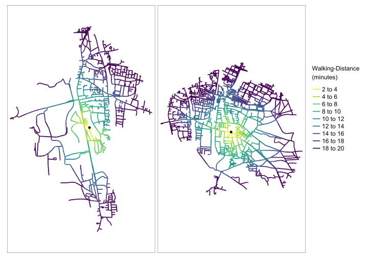
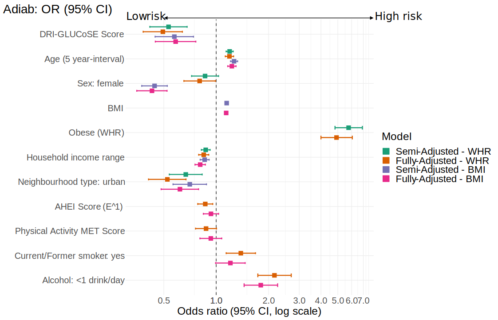

DRI-GLUCoSE — Work in Progress
================

  - [Installation](#installation)
  - [Methods](#methods)
      - [Census variables](#census-variables)
      - [Greenspace](#greenspace)
      - [Exposure Model](#exposure-model)
          - [(i) Road network data and
            isochrones](#i-road-network-data-and-isochrones)
          - [(ii) Distance-weighting](#ii-distance-weighting)
  - [Appendix](#appendix)
      - [Tables](#tables)
      - [Figures](#figures)
      - [Summary Statistics](#summary-statistics)
  - [About](#about)
      - [Package contributors:](#package-contributors)
      - [Thesis authors:](#thesis-authors)
  - [Bibliography](#bibliography)

As elaborated in our recent analyses (Walker et al. 2019; Scarpone et
al. 2020), nearly all previous studies in the literature use either
census unit boundaries or simple buffer zones to measure an individual’s
built environment (BE) exposures or to characterize their local
socioeconomic status (SES) (Gong et al. 2014; Fuertes et al. 2014).
Therefore, we present a distance-weighted, network-based model for
quantifying the combined effects of local greenspace and SES on diabetes
risk, from which we derive an area-based Diabetes Risk Index of
Greenspace, Land Use and Socioeconomic Environments (DRI-GLUCoSE).  
The goal of the `DRIGLUCoSE` package is to provide a public package
containing functions and code used in the development of the DRI-GLUCoSE
Index.

# Installation

This package depends on the
[sfnetworks](https://github.com/luukvdmeer/sfnetworks) package. It is
still in very active development. Therefore, the package is also not on
CRAN yet. Install it directly from GitHub using the `remotes` package in
R.

``` r
remotes::install_github("luukvdmeer/sfnetworks")
```

You can install the latest version of `DRIGLUCoSE` from GitHub with:

``` r
remotes::install_git("https://github.com/STBrinkmann/DRIGLUCoSE")
```

Once installed, the library can be loaded as follows:

``` r
library(DRIGLUCoSE)
```

# Methods

One key purpose of this package is, to provide functions for route
networked derived isochrones. For that purpose we have provided a sample
sf object of 2 points in Erlangen, Germany.

``` r
data(Erlangen)
Erlangen
#> Simple feature collection with 2 features and 2 fields
#> geometry type:  POINT
#> dimension:      XY
#> bbox:           xmin: 35199.46 ymin: -159433.5 xmax: 36281.59 ymax: -159243.2
#> projected CRS:  ETRS89 / LCC Germany (N-E)
#> # A tibble: 2 x 3
#>     tag Speed                 geom
#>   <dbl> <dbl>          <POINT [m]>
#> 1     1  78.5 (35199.46 -159433.5)
#> 2     2  79.8 (36281.59 -159243.2)
```

## Census variables

In our analysis we acquired data of the Canadian census dissemination
areas. It has been converted to a shapefile (sf) with one column per
census variable. To demonstrate we use the following randomly generated
data:

``` r
set.seed(1234)
census <- sf::st_make_grid(
  # Use Sample Data and apply 25 minutes buffer (Speed[m/min] * 25[min]) 
  Erlangen %>% dplyr::mutate(geom = sf::st_buffer(geom, Speed*25)),
  cellsize = 100
  ) %>% 
  sf::st_as_sf() %>% 
  dplyr::mutate(census_var_a = sample(1:1000, n(), replace = TRUE),
                census_var_b = sample(1000:10000, n(), replace = TRUE),
                census_var_c = sample(100000:150000, n(), replace = TRUE)) %>% 
  dplyr::rename(geom = x)

census
#> Simple feature collection with 2142 features and 3 fields
#> geometry type:  POLYGON
#> dimension:      XY
#> bbox:           xmin: 33236.96 ymin: -161396 xmax: 38336.96 ymax: -157196
#> projected CRS:  ETRS89 / LCC Germany (N-E)
#> First 10 features:
#>    census_var_a census_var_b census_var_c                           geom
#> 1           284         2009       114811 POLYGON ((33236.96 -161396,...
#> 2           848         3318       139961 POLYGON ((33336.96 -161396,...
#> 3           918         3954       112673 POLYGON ((33436.96 -161396,...
#> 4           101         3359       137505 POLYGON ((33536.96 -161396,...
#> 5           623         3107       109201 POLYGON ((33636.96 -161396,...
#> 6           905         2630       131656 POLYGON ((33736.96 -161396,...
#> 7           645         6512       135789 POLYGON ((33836.96 -161396,...
#> 8           934         9945       115006 POLYGON ((33936.96 -161396,...
#> 9           400         3583       111379 POLYGON ((34036.96 -161396,...
#> 10          900         7778       137576 POLYGON ((34136.96 -161396,...
```

## Greenspace

In our analysis we acquired LANDSAT images through the United States
Geological Survey’s EarthExplorer platform
(<https://earthexplorer.usgs.gov/>). The Normalized Difference
Vegetation Index
([NDVI](https://gisgeography.com/ndvi-normalized-difference-vegetation-index/))
is used as a metric to model greenspace exposure. Pre-processing of the
LANDSAT images and NDVI calculation has been conducted using the
`LS_L1C` function:

``` r
DRIGLUCoSE::LS_L1C(l1c_path = "docs/LC08_L1TP_193026_20200423_20200508_01_T1_small/", 
                   out_dir = "docs/LS_PreProcessed",
                   # Use Sample Data and apply 25 minutes buffer (Speed[m/min] * 25[min]) 
                   sf_mask = DRIGLUCoSE::Erlangen %>% 
                     dplyr::mutate(geom = sf::st_buffer(geom, Speed*25)),
                   cores = 20)
#> Project raster
#> DN to TOA Reflectance
#> class      : RasterStack 
#> dimensions : 122, 151, 18422, 8  (nrow, ncol, ncell, nlayers)
#> resolution : 30, 30  (x, y)
#> extent     : 33493.69, 38023.69, -161164.2, -157504.2  (xmin, xmax, ymin, ymax)
#> crs        : +proj=lcc +lat_0=51 +lon_0=10.5 +lat_1=48.6666666666667 +lat_2=53.6666666666667 +x_0=0 +y_0=0 +ellps=GRS80 +units=m +no_defs 
#> names      :      Blue,     Green,       Red,       NIR,     SWIR1,     SWIR2,      NDWI,      NDVI 
#> min values :         0,         0,         0,         0,         0,         0,        -1,        -1 
#> max values : 0.2020575, 0.2322532, 0.3076383, 0.5424371, 0.4233773, 0.3753066, 1.0000000, 1.0000000
```

## Exposure Model

In order to estimate each participant’s potential exposures to
greenspace and local SES, we (i) mapped age- and sex-specific walkable
zones around their residential address, and (ii) applied a negative
logit weighting function, such that the estimated effect of greenspace
or SES decreases as distance from the home increases.

### (i) Road network data and isochrones

In order to compute network-based distance metrics, we acquired street
data from OpenStreetMap using the R-package `osmdata` (Padgham et al.
2017). Road types not suitable for walking were removed (e.g.,
motorways). Network data were topologically corrected and split into
\~20 metre-long segments using the R package `nngeo` (Michael Dorman
2020).

``` r
erlangen.osm <- DRIGLUCoSE::osm_roads(x = Erlangen, dist = 20, 
                                      speed = "Speed", cores = 2)
```

This network data was used to derive walking distance buffers for each
participant, based on walking speed. Starting from each participant’s
place of residence, we computed network-constrained buffers with an
off-road width of 40 meters, running in 2-minute increments from 0 to 20
minutes, using the A\*-algorithm (Hart, Nilsson, and Raphael 1968). This
therefore resulted in each participant having ten concentric isochrones,
the sizes of which are a function of individual walking speed and road
network.

``` r
erlangen.isodistances <- DRIGLUCoSE::isodistances(x = Erlangen, 
                                                  road_network = erlangen.osm, 
                                                  tag = "tag", speed = "Speed",
                                                  isochrones_seq = seq(2, 20, 2),
                                                  cores = 2)
```

``` r
erlangen.isochrones <- DRIGLUCoSE::isochrones(x = erlangen.isodistances, 
                                              buffer = 40, cores = 2)
erlangen.isochrones
#> Simple feature collection with 20 features and 2 fields
#> geometry type:  GEOMETRY
#> dimension:      XY
#> bbox:           xmin: 34034 ymin: -160951 xmax: 37750 ymax: -157811
#> projected CRS:  ETRS89 / LCC Germany (N-E)
#> # A tibble: 20 x 3
#>      tag  time                                                              geom
#>  * <dbl> <dbl>                                                    <GEOMETRY [m]>
#>  1     1     2 POLYGON ((35070.01 -159364.4, 35070.01 -159364.3, 35070.05 -1593~
#>  2     1     4 POLYGON ((34939.9 -159373.7, 34939.9 -159373.7, 34939.9 -159373.~
#>  3     1     6 MULTIPOLYGON (((35122.04 -159796.6, 35121.24 -159795.8, 35119.83~
#>  4     1     8 MULTIPOLYGON (((35381.94 -159465.4, 35381.67 -159465.3, 35379.73~
#>  5     1    10 MULTIPOLYGON (((35202.91 -159978.5, 35202.52 -159976.4, 35202.24~
#>  6     1    12 MULTIPOLYGON (((34785.32 -159753, 34785.29 -159752.8, 34781.29 -~
#>  7     1    14 MULTIPOLYGON (((35074.41 -160199.5, 35073.91 -160197.5, 35073.52~
#>  8     1    16 MULTIPOLYGON (((34917.7 -160026.6, 34916.67 -160024.8, 34915.74 ~
#>  9     1    18 MULTIPOLYGON (((35274.98 -160596.8, 35274.87 -160596.3, 35274.49~
#> 10     1    20 MULTIPOLYGON (((35259.52 -160806.4, 35258.77 -160804.6, 35258.06~
#> 11     2     2 POLYGON ((36168.94 -159274.7, 36144.23 -159271.7, 36142.16 -1592~
#> 12     2     4 POLYGON ((35995.6 -159233.7, 35975.79 -159226.8, 35973.83 -15922~
#> 13     2     6 POLYGON ((35822.47 -159166.2, 35822.21 -159165.7, 35821.22 -1591~
#> 14     2     8 MULTIPOLYGON (((36811.11 -159633.3, 36810.49 -159634, 36810.41 -~
#> 15     2    10 MULTIPOLYGON (((35928.36 -159544.3, 35928.19 -159543.7, 35926.19~
#> 16     2    12 MULTIPOLYGON (((35950.69 -159884.5, 35951 -159883.5, 35951.32 -1~
#> 17     2    14 MULTIPOLYGON (((36704.16 -160015.9, 36682.73 -160017.3, 36682.82~
#> 18     2    16 MULTIPOLYGON (((36662.22 -159980, 36662.1 -159978.9, 36662.01 -1~
#> 19     2    18 MULTIPOLYGON (((35846.36 -160338.5, 35846.43 -160338.4, 35846.75~
#> 20     2    20 MULTIPOLYGON (((35746 -160426, 35746 -160423, 35746.05 -160420.9~
```

Figure 1 shows isodistances of the two points of the sample data in
Erlangen, Germany.



### (ii) Distance-weighting

In order to account for the diminishing effect of SES and greenspace
exposure as distance increases, we fitted a logit function to weight
each incremental isochrone, such that the influence of a variable
decreases with increasing distance from the household, i.e., features
that are farther away have less influence than nearby features, as
illustrated in Figure 2. A logit function was selected as it
heuristically approximates a suitable distance-decay function (Bauer and
Groneberg 2016; Jia, Wang, and Xierali 2019).  
The distance-weighting is separated in two parts, first the logit
function (1) that is used for both SES and greenspace variables, and
second the proportional weights function (4) that is only applied on SES
variables.

<center>

  
dr}{\\int_0^{r_{t_{max}}} \\, g(r)dr}, t=1\\\\
      \\cfrac{\\int_{r_{t-1}}^{r_t}  \\, g(r)dr}{\\int_0^{r_{t_{max}}} \\, g(r)dr}, t\>1
    \\end{cases}
    && \\text{(1)}
\\end{align*}
")  

</center>

Each isochrone  is
assigned a distance weight
, calculated as
the integral of the logistic distance decay function
") (2)

<center>

  
 =
    \\cfrac{1}{1 + e^{ \\,b \\,(r-m)}}
    && \\text{(2)}
\\end{align*}
")  

</center>

with 
and , in the interval between the mean inner radius

and mean outer radius  of the isochrone (e.g. 2 to 4 minutes isochrones), normalized by
the integral from 0 to the outermost isochrone boundary
 (e.g. 20 minutes isochrone). Weighted summary statistics
to describe the greenspace (e.g. mean or minimum NDVI) are thus
described as (3)

<center>

  

    && \\text{(3)}
\\end{align*}
")  

</center>

For SES variables the proportional weights of the census areas within
the isochrone are further defined as (4)

<center>

  
}
    {A(I_t)}
    && \\text{(4)}
\\end{align*}
")  

</center>

with the proportion of the area of the intersection of the census area
 and the
isochrone , and
the area of the isochrone
. The weighted
value of the SES variable
 in the census
area  is then defined as
(5)

<center>

  

    && \\text{(5)}
\\end{align*}
")  

</center>

Figure 2 visualizes the different submodels used for distance-weighting
SES and greenspace. Fig. 2a shows the unweighted values of a SES
variable and fig. 2b has been calculated using (5), thus representing
the proportional weights of all intersections with the census areas and
isochrones. Greenspace is weighted as shown in fig. 2c using (3).

<div class="figure">


<p class="caption">

Figure 2: Unweighted values (a) and network-based distance-weighting
function for socioeconomic variables (b) and greenspace (c). Bold black
lines indicate the isochrones.

</p>

</div>

  
  
The distance-weighting for the LANDSAT derived NDVI raster (greenspace
exposure) is handled using `LS_band_weightin`, and SES distance- and
areal-weighting using `census_weighting`.

``` r
# Calculate sd, median, 5th percentile, 95th percentile and skew of NDVI values
NDVI_weighted <- 
  DRIGLUCoSE::LS_band_weighting(isochrones = erlangen.isochrones, tag = "tag",
                                landsat_list = dir("docs/LS_PreProcessed",
                                                   pattern = ".grd",
                                                   full.names = T) %>%
                                  lapply(raster::brick),
                                stats = list("sd", "median", 
                                             list("percentile", 0.05), 
                                             list("percentile", 0.95),
                                             "skew"), 
                                b = 8, m = 0.6, cores = 2)

NDVI_weighted
#> # A tibble: 2 x 6
#>     tag    sd median X5_percentile X95_percentile     skew
#>   <dbl> <dbl>  <dbl>         <dbl>          <dbl>    <dbl>
#> 1     1 0.206  0.601         0.272          0.908 -0.110  
#> 2     2 0.102  0.538         0.367          0.709  0.00458
```

``` r
census_weighted <- DRIGLUCoSE::census_weighting(isochrones = erlangen.isochrones, 
                                                tag = "tag", census = census, 
                                                b = 8, m = 0.6, cores = 2)
census_weighted
#> # A tibble: 2 x 4
#>     tag census_var_a census_var_b census_var_c
#>   <dbl>        <dbl>        <dbl>        <dbl>
#> 1     1         554.        5267.      130635.
#> 2     2         551.        5416.      124485.
```

# Appendix

## Tables

<table style='width:90%; font-family: "Arial Narrow", "Source Sans Pro", sans-serif; width: auto !important; margin-left: auto; margin-right: auto;' class=" lightable-classic lightable-striped">

<caption>

Table A.1: Logistic models for all multivariable models with odds ratios
(OR) for diabetes, 95% CI, and p-values.

</caption>

<thead>

<tr>

<th style="empty-cells: hide;" colspan="2">

</th>

<th style="padding-bottom:0; padding-left:3px;padding-right:3px;text-align: center; font-style: italic; " colspan="2">

<div style="TRUE">

Semi-Adjusted

</div>

</th>

<th style="padding-bottom:0; padding-left:3px;padding-right:3px;text-align: center; font-style: italic; " colspan="2">

<div style="TRUE">

Fully-Adjusted

</div>

</th>

</tr>

<tr>

<th style="text-align:left;font-weight: bold;">

Parameter

</th>

<th style="text-align:right;font-weight: bold;">

OR<br>(bivariate)

</th>

<th style="text-align:right;font-weight: bold;">

OR<br>(WHR-adjusted)

</th>

<th style="text-align:right;font-weight: bold;">

OR<br>(BMI-adjusted)

</th>

<th style="text-align:right;font-weight: bold;">

OR<br>(WHR-adjusted)

</th>

<th style="text-align:right;font-weight: bold;">

OR<br>(BMI-adjusted)

</th>

</tr>

</thead>

<tbody>

<tr>

<td style="text-align:left;">

DRI-GLUCoSE Score

</td>

<td style="text-align:right;">

0.41 (0.30-0.54,<br>p\<0.001)

</td>

<td style="text-align:right;">

0.53 (0.42-0.68,<br>p\<0.001)

</td>

<td style="text-align:right;">

0.58 (0.45-0.74,<br>p\<0.001)

</td>

<td style="text-align:right;">

0.49 (0.38-0.64,<br>p\<0.001)

</td>

<td style="text-align:right;">

0.58 (0.45-0.76,<br>p\<0.001)

</td>

</tr>

<tr>

<td style="text-align:left;">

Age (5 year-interval)

</td>

<td style="text-align:right;">

1.27 (1.19-1.36,<br>p\<0.001)

</td>

<td style="text-align:right;">

1.20 (1.14-1.25,<br>p\<0.001)

</td>

<td style="text-align:right;">

1.27 (1.21-1.33,<br>p\<0.001)

</td>

<td style="text-align:right;">

1.19 (1.13-1.26,<br>p\<0.001)

</td>

<td style="text-align:right;">

1.23 (1.17-1.30,<br>p\<0.001)

</td>

</tr>

<tr>

<td style="text-align:left;">

Sex: female

</td>

<td style="text-align:right;">

0.61 (0.48-0.76,<br>p\<0.001)

</td>

<td style="text-align:right;">

0.86 (0.72-1.03,<br>p=0.106)

</td>

<td style="text-align:right;">

0.44 (0.37-0.52,<br>p\<0.001)

</td>

<td style="text-align:right;">

0.80 (0.65-0.99,<br>p=0.040)

</td>

<td style="text-align:right;">

0.43 (0.35-0.52,<br>p\<0.001)

</td>

</tr>

<tr>

<td style="text-align:left;">

Obese (WHR)

</td>

<td style="text-align:right;">

5.54 (4.24-7.33,<br>p\<0.001)

</td>

<td style="text-align:right;">

5.76 (4.82-6.92,<br>p\<0.001)

</td>

<td style="text-align:right;">

</td>

<td style="text-align:right;">

4.91 (4.00-6.05,<br>p\<0.001)

</td>

<td style="text-align:right;">

</td>

</tr>

<tr>

<td style="text-align:left;">

BMI

</td>

<td style="text-align:right;">

1.14 (1.12-1.16,<br>p\<0.001)

</td>

<td style="text-align:right;">

</td>

<td style="text-align:right;">

1.15 (1.13-1.17,<br>p\<0.001)

</td>

<td style="text-align:right;">

</td>

<td style="text-align:right;">

1.14 (1.12-1.16,<br>p\<0.001)

</td>

</tr>

<tr>

<td style="text-align:left;">

Household income range

</td>

<td style="text-align:right;">

0.74 (0.69-0.80,<br>p\<0.001)

</td>

<td style="text-align:right;">

0.87 (0.82-0.92,<br>p\<0.001)

</td>

<td style="text-align:right;">

0.86 (0.81-0.91,<br>p\<0.001)

</td>

<td style="text-align:right;">

0.85 (0.79-0.91,<br>p\<0.001)

</td>

<td style="text-align:right;">

0.81 (0.76-0.87,<br>p\<0.001)

</td>

</tr>

<tr>

<td style="text-align:left;">

Neighbourhood type: urban

</td>

<td style="text-align:right;">

0.88 (0.67-1.16,<br>p=0.385)

</td>

<td style="text-align:right;">

0.67 (0.54-0.83,<br>p\<0.001)

</td>

<td style="text-align:right;">

0.71 (0.57-0.88,<br>p=0.002)

</td>

<td style="text-align:right;">

0.52 (0.41-0.67,<br>p\<0.001)

</td>

<td style="text-align:right;">

0.62 (0.48-0.79,<br>p\<0.001)

</td>

</tr>

<tr>

<td style="text-align:left;">

AHEI Score (E^1)

</td>

<td style="text-align:right;">

0.76 (0.68-0.85,<br>p\<0.001)

</td>

<td style="text-align:right;">

</td>

<td style="text-align:right;">

</td>

<td style="text-align:right;">

0.87 (0.78-0.96,<br>p=0.004)

</td>

<td style="text-align:right;">

0.93 (0.84-1.03,<br>p=0.180)

</td>

</tr>

<tr>

<td style="text-align:left;">

Physical Activity MET Score

</td>

<td style="text-align:right;">

0.74 (0.63-0.88,<br>p\<0.001)

</td>

<td style="text-align:right;">

</td>

<td style="text-align:right;">

</td>

<td style="text-align:right;">

0.87 (0.76-1.00,<br>p=0.058)

</td>

<td style="text-align:right;">

0.93 (0.81-1.08,<br>p=0.335)

</td>

</tr>

<tr>

<td style="text-align:left;">

Current/Former smoker: yes

</td>

<td style="text-align:right;">

1.66 (1.32-2.09,<br>p\<0.001)

</td>

<td style="text-align:right;">

</td>

<td style="text-align:right;">

</td>

<td style="text-align:right;">

1.39 (1.14-1.68,<br>p\<0.001)

</td>

<td style="text-align:right;">

1.21 (0.99-1.47,<br>p=0.059)

</td>

</tr>

<tr>

<td style="text-align:left;">

Alcohol: \<1 drink/day

</td>

<td style="text-align:right;">

1.19 (0.92-1.54,<br>p=0.184)

</td>

<td style="text-align:right;">

</td>

<td style="text-align:right;">

</td>

<td style="text-align:right;">

2.16 (1.74-2.70,<br>p\<0.001)

</td>

<td style="text-align:right;">

1.80 (1.45-2.25,<br>p\<0.001)

</td>

</tr>

</tbody>

</table>

  

<table style='width:90%;border-bottom: 0; font-family: "Arial Narrow", "Source Sans Pro", sans-serif; width: auto !important; margin-left: auto; margin-right: auto;' class=" lightable-classic">

<caption>

Table A.2: Model Performance for all multivariable models.

</caption>

<thead>

<tr>

<th style="empty-cells: hide;" colspan="1">

</th>

<th style="padding-bottom:0; padding-left:3px;padding-right:3px;text-align: center; font-style: italic; " colspan="2">

<div style="border-bottom: 1px solid #111111; margin-bottom: -1px; ">

Semi-Adjusted

</div>

</th>

<th style="padding-bottom:0; padding-left:3px;padding-right:3px;text-align: center; font-style: italic; " colspan="2">

<div style="border-bottom: 1px solid #111111; margin-bottom: -1px; ">

Fully-Adjusted

</div>

</th>

</tr>

<tr>

<th style="text-align:left;font-weight: bold;">

Metric

</th>

<th style="text-align:center;font-weight: bold;">

OR<br>(WHR-adjusted)

</th>

<th style="text-align:center;font-weight: bold;">

OR<br>(BMI-adjusted)

</th>

<th style="text-align:center;font-weight: bold;">

OR<br>(WHR-adjusted)

</th>

<th style="text-align:center;font-weight: bold;">

OR<br>(BMI-adjusted)

</th>

</tr>

</thead>

<tbody>

<tr>

<td style="text-align:left;">

Probability Threshold \*

</td>

<td style="text-align:center;">

0.45

</td>

<td style="text-align:center;">

0.48

</td>

<td style="text-align:center;">

0.45

</td>

<td style="text-align:center;">

0.48

</td>

</tr>

<tr>

<td style="text-align:left;">

Accuracy

</td>

<td style="text-align:center;">

0.67

</td>

<td style="text-align:center;">

0.74

</td>

<td style="text-align:center;">

0.72

</td>

<td style="text-align:center;">

0.76

</td>

</tr>

<tr>

<td style="text-align:left;">

Sensitivity

</td>

<td style="text-align:center;">

0.66

</td>

<td style="text-align:center;">

0.75

</td>

<td style="text-align:center;">

0.72

</td>

<td style="text-align:center;">

0.77

</td>

</tr>

<tr>

<td style="text-align:left;">

Specificity

</td>

<td style="text-align:center;">

0.71

</td>

<td style="text-align:center;">

0.65

</td>

<td style="text-align:center;">

0.68

</td>

<td style="text-align:center;">

0.66

</td>

</tr>

<tr>

<td style="text-align:left;">

Youden index

</td>

<td style="text-align:center;">

0.37

</td>

<td style="text-align:center;">

0.40

</td>

<td style="text-align:center;">

0.40

</td>

<td style="text-align:center;">

0.43

</td>

</tr>

</tbody>

<tfoot>

<tr>

<td style="padding: 0; " colspan="100%">

<sup>\*</sup> Probability threshold used for predicting Diabetes. Values
equal or greater than this threshold are mapped as “No”.

</td>

</tr>

</tfoot>

</table>

  

## Figures

<div class="figure">



<p class="caption">

Figure A.1: Forest plot showing significant effects for both BMI- and
WHR-controlled multivariable logistic models.

</p>

</div>

  

<div class="figure">


<p class="caption">

Figure A.2: The ROC curves for both BMI- and WHR-controlled
multivariable logistic models.

</p>

</div>

## Summary Statistics

<table style='width:90%; font-family: "Arial Narrow", "Source Sans Pro", sans-serif; width: auto !important; margin-left: auto; margin-right: auto;' class=" lightable-classic">

<caption>

Table A.3: Baseline characteristics of the study population by diabetes
status.

</caption>

<thead>

<tr>

<th style="text-align:left;font-weight: bold;">

Parameter

</th>

<th style="text-align:left;font-weight: bold;">

No Diabetes (N=4481)

</th>

<th style="text-align:left;font-weight: bold;">

Diabetes (N=497)

</th>

<th style="text-align:left;font-weight: bold;">

Total (N=4978)

</th>

</tr>

</thead>

<tbody>

<tr>

<td style="text-align:left;">

Total included

</td>

<td style="text-align:left;">

4481 (90.0%)

</td>

<td style="text-align:left;">

497 (10.0%)

</td>

<td style="text-align:left;">

4978

</td>

</tr>

<tr grouplength="2">

<td colspan="4" style="border-bottom: 0;">

<strong>City</strong>

</td>

</tr>

<tr>

<td style="text-align:left; padding-left:  2em;" indentlevel="1">

Hamilton

</td>

<td style="text-align:left;">

2255 (50.3%)

</td>

<td style="text-align:left;">

324 (65.2%)

</td>

<td style="text-align:left;">

2579 (51.8%)

</td>

</tr>

<tr>

<td style="text-align:left; padding-left:  2em;" indentlevel="1">

Vancouver

</td>

<td style="text-align:left;">

2226 (49.7%)

</td>

<td style="text-align:left;">

173 (34.8%)

</td>

<td style="text-align:left;">

2399 (48.2%)

</td>

</tr>

<tr grouplength="24">

<td colspan="4" style="background-color: #666; color: #fff;">

<strong>Participant data</strong>

</td>

</tr>

<tr grouplength="2">

<td colspan="4" style="border-bottom: 0;">

<strong>BMI</strong>

</td>

</tr>

<tr>

<td style="text-align:left; padding-left:  2em;" indentlevel="2">

Mean (SD)

</td>

<td style="text-align:left;">

27.3 (5.3)

</td>

<td style="text-align:left;">

32.1 (6.4)

</td>

<td style="text-align:left;">

27.8 (5.6)

</td>

</tr>

<tr>

<td style="text-align:left; padding-left:  2em;" indentlevel="2">

Median (Q1, Q3)

</td>

<td style="text-align:left;">

26.4 (23.8, 29.9)

</td>

<td style="text-align:left;">

30.9 (27.4, 35.8)

</td>

<td style="text-align:left;">

26.8 (24.0, 30.4)

</td>

</tr>

<tr grouplength="2">

<td colspan="4" style="border-bottom: 0;">

<strong>Waist to hip ratio</strong>

</td>

</tr>

<tr>

<td style="text-align:left; padding-left:  2em;" indentlevel="2">

Mean (SD)

</td>

<td style="text-align:left;">

85.2 (9.0)

</td>

<td style="text-align:left;">

93.6 (8.5)

</td>

<td style="text-align:left;">

86.1 (9.3)

</td>

</tr>

<tr>

<td style="text-align:left; padding-left:  2em;" indentlevel="2">

Median (Q1, Q3)

</td>

<td style="text-align:left;">

85.2 (78.6, 91.6)

</td>

<td style="text-align:left;">

94.2 (87.8, 99.6)

</td>

<td style="text-align:left;">

86.0 (79.3, 92.6)

</td>

</tr>

<tr grouplength="2">

<td colspan="4" style="border-bottom: 0;">

<strong>Obesity (WHR)</strong>

</td>

</tr>

<tr>

<td style="text-align:left; padding-left:  2em;" indentlevel="2">

No

</td>

<td style="text-align:left;">

2696 (60.2%)

</td>

<td style="text-align:left;">

112 (22.5%)

</td>

<td style="text-align:left;">

2808 (56.4%)

</td>

</tr>

<tr>

<td style="text-align:left; padding-left:  2em;" indentlevel="2">

Yes

</td>

<td style="text-align:left;">

1785 (39.8%)

</td>

<td style="text-align:left;">

385 (77.5%)

</td>

<td style="text-align:left;">

2170 (43.6%)

</td>

</tr>

<tr grouplength="2">

<td colspan="4" style="border-bottom: 0;">

<strong>Age (years)</strong>

</td>

</tr>

<tr>

<td style="text-align:left; padding-left:  2em;" indentlevel="2">

Mean (SD)

</td>

<td style="text-align:left;">

52.7 (9.3)

</td>

<td style="text-align:left;">

56.9 (8.4)

</td>

<td style="text-align:left;">

53.1 (9.3)

</td>

</tr>

<tr>

<td style="text-align:left; padding-left:  2em;" indentlevel="2">

Median (Q1, Q3)

</td>

<td style="text-align:left;">

53.0 (45.0, 60.0)

</td>

<td style="text-align:left;">

57.0 (51.0, 63.0)

</td>

<td style="text-align:left;">

53.0 (46.0, 61.0)

</td>

</tr>

<tr grouplength="2">

<td colspan="4" style="border-bottom: 0;">

<strong>Sex</strong>

</td>

</tr>

<tr>

<td style="text-align:left; padding-left:  2em;" indentlevel="2">

Male

</td>

<td style="text-align:left;">

2011 (44.9%)

</td>

<td style="text-align:left;">

286 (57.5%)

</td>

<td style="text-align:left;">

2297 (46.1%)

</td>

</tr>

<tr>

<td style="text-align:left; padding-left:  2em;" indentlevel="2">

Female

</td>

<td style="text-align:left;">

2470 (55.1%)

</td>

<td style="text-align:left;">

211 (42.5%)

</td>

<td style="text-align:left;">

2681 (53.9%)

</td>

</tr>

<tr grouplength="6">

<td colspan="4" style="border-bottom: 0;">

<strong>Household Income Range</strong>

</td>

</tr>

<tr>

<td style="text-align:left; padding-left:  2em;" indentlevel="2">

\>90k

</td>

<td style="text-align:left;">

1751 (39.1%)

</td>

<td style="text-align:left;">

127 (25.6%)

</td>

<td style="text-align:left;">

1878 (37.7%)

</td>

</tr>

<tr>

<td style="text-align:left; padding-left:  2em;" indentlevel="2">

45k-65k

</td>

<td style="text-align:left;">

730 (16.3%)

</td>

<td style="text-align:left;">

85 (17.1%)

</td>

<td style="text-align:left;">

815 (16.4%)

</td>

</tr>

<tr>

<td style="text-align:left; padding-left:  2em;" indentlevel="2">

30k-45k

</td>

<td style="text-align:left;">

548 (12.2%)

</td>

<td style="text-align:left;">

96 (19.3%)

</td>

<td style="text-align:left;">

644 (12.9%)

</td>

</tr>

<tr>

<td style="text-align:left; padding-left:  2em;" indentlevel="2">

65k-90k

</td>

<td style="text-align:left;">

973 (21.7%)

</td>

<td style="text-align:left;">

79 (15.9%)

</td>

<td style="text-align:left;">

1052 (21.1%)

</td>

</tr>

<tr>

<td style="text-align:left; padding-left:  2em;" indentlevel="2">

20k-30k

</td>

<td style="text-align:left;">

299 (6.7%)

</td>

<td style="text-align:left;">

65 (13.1%)

</td>

<td style="text-align:left;">

364 (7.3%)

</td>

</tr>

<tr>

<td style="text-align:left; padding-left:  2em;" indentlevel="2">

\<20k

</td>

<td style="text-align:left;">

180 (4.0%)

</td>

<td style="text-align:left;">

45 (9.1%)

</td>

<td style="text-align:left;">

225 (4.5%)

</td>

</tr>

<tr grouplength="2">

<td colspan="4" style="border-bottom: 0;">

<strong>AHEI Score</strong>

</td>

</tr>

<tr>

<td style="text-align:left; padding-left:  2em;" indentlevel="2">

Mean (SD)

</td>

<td style="text-align:left;">

37.7 (10.0)

</td>

<td style="text-align:left;">

35.0 (9.5)

</td>

<td style="text-align:left;">

37.4 (10.0)

</td>

</tr>

<tr>

<td style="text-align:left; padding-left:  2em;" indentlevel="2">

Median (Q1, Q3)

</td>

<td style="text-align:left;">

37.7 (30.7, 44.8)

</td>

<td style="text-align:left;">

34.8 (28.0, 41.4)

</td>

<td style="text-align:left;">

37.4 (30.4, 44.5)

</td>

</tr>

<tr grouplength="2">

<td colspan="4" style="border-bottom: 0;">

<strong>Physical Activity MET Score</strong>

</td>

</tr>

<tr>

<td style="text-align:left; padding-left:  2em;" indentlevel="2">

Mean (SD)

</td>

<td style="text-align:left;">

2.5 (0.6)

</td>

<td style="text-align:left;">

2.4 (0.7)

</td>

<td style="text-align:left;">

2.5 (0.6)

</td>

</tr>

<tr>

<td style="text-align:left; padding-left:  2em;" indentlevel="2">

Median (Q1, Q3)

</td>

<td style="text-align:left;">

3.0 (2.0, 3.0)

</td>

<td style="text-align:left;">

2.0 (2.0, 3.0)

</td>

<td style="text-align:left;">

3.0 (2.0, 3.0)

</td>

</tr>

<tr grouplength="2">

<td colspan="4" style="border-bottom: 0;">

<strong>Ever smoked</strong>

</td>

</tr>

<tr>

<td style="text-align:left; padding-left:  2em;" indentlevel="2">

No

</td>

<td style="text-align:left;">

2048 (55.2%)

</td>

<td style="text-align:left;">

172 (41.2%)

</td>

<td style="text-align:left;">

2220 (53.8%)

</td>

</tr>

<tr>

<td style="text-align:left; padding-left:  2em;" indentlevel="2">

Yes

</td>

<td style="text-align:left;">

1664 (44.8%)

</td>

<td style="text-align:left;">

245 (58.8%)

</td>

<td style="text-align:left;">

1909 (46.2%)

</td>

</tr>

<tr grouplength="2">

<td colspan="4" style="border-bottom: 0;">

<strong>Daily Drinker</strong>

</td>

</tr>

<tr>

<td style="text-align:left; padding-left:  2em;" indentlevel="2">

\>=1 drinks/day

</td>

<td style="text-align:left;">

1140 (30.7%)

</td>

<td style="text-align:left;">

112 (26.9%)

</td>

<td style="text-align:left;">

1252 (30.3%)

</td>

</tr>

<tr>

<td style="text-align:left; padding-left:  2em;" indentlevel="2">

\<1 drink/day

</td>

<td style="text-align:left;">

2572 (69.3%)

</td>

<td style="text-align:left;">

305 (73.1%)

</td>

<td style="text-align:left;">

2877 (69.7%)

</td>

</tr>

<tr grouplength="24">

<td colspan="4" style="background-color: #666; color: #fff;">

<strong>Census variables</strong>

</td>

</tr>

<tr grouplength="2">

<td colspan="4" style="border-bottom: 0;">

<strong>Neighbourhood type</strong>

</td>

</tr>

<tr>

<td style="text-align:left; padding-left:  2em;" indentlevel="2">

suburban/rural

</td>

<td style="text-align:left;">

3489 (77.9%)

</td>

<td style="text-align:left;">

398 (80.1%)

</td>

<td style="text-align:left;">

3887 (78.1%)

</td>

</tr>

<tr>

<td style="text-align:left; padding-left:  2em;" indentlevel="2">

urban

</td>

<td style="text-align:left;">

992 (22.1%)

</td>

<td style="text-align:left;">

99 (19.9%)

</td>

<td style="text-align:left;">

1091 (21.9%)

</td>

</tr>

<tr grouplength="2">

<td colspan="4" style="border-bottom: 0;">

<strong>Individual mean income (CAD/1000)</strong>

</td>

</tr>

<tr>

<td style="text-align:left; padding-left:  2em;" indentlevel="2">

Mean (SD)

</td>

<td style="text-align:left;">

38.1 (13.2)

</td>

<td style="text-align:left;">

34.4 (11.5)

</td>

<td style="text-align:left;">

37.7 (13.1)

</td>

</tr>

<tr>

<td style="text-align:left; padding-left:  2em;" indentlevel="2">

Median (Q1, Q3)

</td>

<td style="text-align:left;">

35.0 (30.0, 42.0)

</td>

<td style="text-align:left;">

32.0 (27.0, 39.0)

</td>

<td style="text-align:left;">

34.0 (30.0, 42.0)

</td>

</tr>

<tr grouplength="2">

<td colspan="4" style="border-bottom: 0;">

<strong>Household median income (CAD/1000)</strong>

</td>

</tr>

<tr>

<td style="text-align:left; padding-left:  2em;" indentlevel="2">

Mean (SD)

</td>

<td style="text-align:left;">

65.5 (20.1)

</td>

<td style="text-align:left;">

60.9 (19.6)

</td>

<td style="text-align:left;">

65.0 (20.1)

</td>

</tr>

<tr>

<td style="text-align:left; padding-left:  2em;" indentlevel="2">

Median (Q1, Q3)

</td>

<td style="text-align:left;">

62.0 (52.0, 76.0)

</td>

<td style="text-align:left;">

57.0 (46.0, 71.0)

</td>

<td style="text-align:left;">

61.0 (52.0, 75.0)

</td>

</tr>

<tr grouplength="2">

<td colspan="4" style="border-bottom: 0;">

<strong>Prevalence of low income (%)</strong>

</td>

</tr>

<tr>

<td style="text-align:left; padding-left:  2em;" indentlevel="2">

Mean (SD)

</td>

<td style="text-align:left;">

9.6 (6.4)

</td>

<td style="text-align:left;">

11.2 (7.0)

</td>

<td style="text-align:left;">

9.8 (6.5)

</td>

</tr>

<tr>

<td style="text-align:left; padding-left:  2em;" indentlevel="2">

Median (Q1, Q3)

</td>

<td style="text-align:left;">

8.4 (5.0, 13.9)

</td>

<td style="text-align:left;">

9.9 (5.7, 16.4)

</td>

<td style="text-align:left;">

8.5 (5.0, 14.2)

</td>

</tr>

<tr grouplength="2">

<td colspan="4" style="border-bottom: 0;">

<strong>Commute Walking/Bicycle (%)</strong>

</td>

</tr>

<tr>

<td style="text-align:left; padding-left:  2em;" indentlevel="2">

Mean (SD)

</td>

<td style="text-align:left;">

7.6 (6.8)

</td>

<td style="text-align:left;">

6.9 (5.8)

</td>

<td style="text-align:left;">

7.6 (6.7)

</td>

</tr>

<tr>

<td style="text-align:left; padding-left:  2em;" indentlevel="2">

Median (Q1, Q3)

</td>

<td style="text-align:left;">

5.2 (3.1, 9.9)

</td>

<td style="text-align:left;">

5.4 (3.2, 8.6)

</td>

<td style="text-align:left;">

5.3 (3.1, 9.8)

</td>

</tr>

<tr grouplength="2">

<td colspan="4" style="border-bottom: 0;">

<strong>Labour force participation rate (%)</strong>

</td>

</tr>

<tr>

<td style="text-align:left; padding-left:  2em;" indentlevel="2">

Mean (SD)

</td>

<td style="text-align:left;">

66.8 (7.3)

</td>

<td style="text-align:left;">

65.4 (6.9)

</td>

<td style="text-align:left;">

66.7 (7.2)

</td>

</tr>

<tr>

<td style="text-align:left; padding-left:  2em;" indentlevel="2">

Median (Q1, Q3)

</td>

<td style="text-align:left;">

66.8 (61.9, 71.7)

</td>

<td style="text-align:left;">

64.8 (60.8, 69.7)

</td>

<td style="text-align:left;">

66.7 (61.8, 71.4)

</td>

</tr>

<tr grouplength="2">

<td colspan="4" style="border-bottom: 0;">

<strong>Gov’t transfer payments (%)</strong>

</td>

</tr>

<tr>

<td style="text-align:left; padding-left:  2em;" indentlevel="2">

Mean (SD)

</td>

<td style="text-align:left;">

10.0 (5.0)

</td>

<td style="text-align:left;">

12.3 (5.9)

</td>

<td style="text-align:left;">

10.2 (5.1)

</td>

</tr>

<tr>

<td style="text-align:left; padding-left:  2em;" indentlevel="2">

Median (Q1, Q3)

</td>

<td style="text-align:left;">

9.1 (6.0, 12.9)

</td>

<td style="text-align:left;">

11.4 (7.5, 16.0)

</td>

<td style="text-align:left;">

9.3 (6.1, 13.3)

</td>

</tr>

<tr grouplength="2">

<td colspan="4" style="border-bottom: 0;">

<strong>Unemployment rate (%)</strong>

</td>

</tr>

<tr>

<td style="text-align:left; padding-left:  2em;" indentlevel="2">

Mean (SD)

</td>

<td style="text-align:left;">

5.6 (2.2)

</td>

<td style="text-align:left;">

6.3 (2.5)

</td>

<td style="text-align:left;">

5.6 (2.2)

</td>

</tr>

<tr>

<td style="text-align:left; padding-left:  2em;" indentlevel="2">

Median (Q1, Q3)

</td>

<td style="text-align:left;">

5.5 (4.0, 6.8)

</td>

<td style="text-align:left;">

6.0 (4.8, 7.6)

</td>

<td style="text-align:left;">

5.6 (4.1, 6.9)

</td>

</tr>

<tr grouplength="2">

<td colspan="4" style="border-bottom: 0;">

<strong>Lone parent families (%)</strong>

</td>

</tr>

<tr>

<td style="text-align:left; padding-left:  2em;" indentlevel="2">

Mean (SD)

</td>

<td style="text-align:left;">

15.0 (5.8)

</td>

<td style="text-align:left;">

17.3 (6.9)

</td>

<td style="text-align:left;">

15.2 (6.0)

</td>

</tr>

<tr>

<td style="text-align:left; padding-left:  2em;" indentlevel="2">

Median (Q1, Q3)

</td>

<td style="text-align:left;">

14.4 (11.5, 18.0)

</td>

<td style="text-align:left;">

16.1 (12.7, 21.2)

</td>

<td style="text-align:left;">

14.5 (11.6, 18.3)

</td>

</tr>

<tr grouplength="2">

<td colspan="4" style="border-bottom: 0;">

<strong>Education - No degree (%)</strong>

</td>

</tr>

<tr>

<td style="text-align:left; padding-left:  2em;" indentlevel="2">

Mean (SD)

</td>

<td style="text-align:left;">

19.7 (9.0)

</td>

<td style="text-align:left;">

23.8 (10.0)

</td>

<td style="text-align:left;">

20.1 (9.2)

</td>

</tr>

<tr>

<td style="text-align:left; padding-left:  2em;" indentlevel="2">

Median (Q1, Q3)

</td>

<td style="text-align:left;">

17.7 (13.1, 25.2)

</td>

<td style="text-align:left;">

20.9 (16.0, 31.6)

</td>

<td style="text-align:left;">

17.9 (13.3, 26.0)

</td>

</tr>

<tr grouplength="2">

<td colspan="4" style="border-bottom: 0;">

<strong>Private Dwellings - Owned (%)</strong>

</td>

</tr>

<tr>

<td style="text-align:left; padding-left:  2em;" indentlevel="2">

Mean (SD)

</td>

<td style="text-align:left;">

74.0 (16.3)

</td>

<td style="text-align:left;">

73.2 (15.8)

</td>

<td style="text-align:left;">

73.9 (16.3)

</td>

</tr>

<tr>

<td style="text-align:left; padding-left:  2em;" indentlevel="2">

Median (Q1, Q3)

</td>

<td style="text-align:left;">

76.5 (62.6, 87.4)

</td>

<td style="text-align:left;">

74.6 (63.0, 85.7)

</td>

<td style="text-align:left;">

76.3 (62.6, 87.3)

</td>

</tr>

<tr grouplength="2">

<td colspan="4" style="border-bottom: 0;">

<strong>Private Dwellings - Rented (%)</strong>

</td>

</tr>

<tr>

<td style="text-align:left; padding-left:  2em;" indentlevel="2">

Mean (SD)

</td>

<td style="text-align:left;">

25.7 (16.0)

</td>

<td style="text-align:left;">

26.4 (15.3)

</td>

<td style="text-align:left;">

25.8 (15.9)

</td>

</tr>

<tr>

<td style="text-align:left; padding-left:  2em;" indentlevel="2">

Median (Q1, Q3)

</td>

<td style="text-align:left;">

23.2 (12.5, 37.2)

</td>

<td style="text-align:left;">

25.3 (14.0, 36.9)

</td>

<td style="text-align:left;">

23.5 (12.6, 37.2)

</td>

</tr>

<tr grouplength="8">

<td colspan="4" style="background-color: #666; color: #fff;">

<strong>Normalized Difference Vegetation Index (NDVI)</strong>

</td>

</tr>

<tr grouplength="2">

<td colspan="4" style="border-bottom: 0;">

<strong>NDVI - Median</strong>

</td>

</tr>

<tr>

<td style="text-align:left; padding-left:  2em;" indentlevel="2">

Mean (SD)

</td>

<td style="text-align:left;">

0.344 (0.087)

</td>

<td style="text-align:left;">

0.318 (0.081)

</td>

<td style="text-align:left;">

0.341 (0.087)

</td>

</tr>

<tr>

<td style="text-align:left; padding-left:  2em;" indentlevel="2">

Median (Q1, Q3)

</td>

<td style="text-align:left;">

0.337 (0.294, 0.377)

</td>

<td style="text-align:left;">

0.315 (0.270, 0.359)

</td>

<td style="text-align:left;">

0.335 (0.291, 0.375)

</td>

</tr>

<tr grouplength="2">

<td colspan="4" style="border-bottom: 0;">

<strong>NDVI - Standard Deviation</strong>

</td>

</tr>

<tr>

<td style="text-align:left; padding-left:  2em;" indentlevel="2">

Mean (SD)

</td>

<td style="text-align:left;">

0.098 (0.024)

</td>

<td style="text-align:left;">

0.096 (0.023)

</td>

<td style="text-align:left;">

0.098 (0.024)

</td>

</tr>

<tr>

<td style="text-align:left; padding-left:  2em;" indentlevel="2">

Median (Q1, Q3)

</td>

<td style="text-align:left;">

0.095 (0.082, 0.111)

</td>

<td style="text-align:left;">

0.092 (0.081, 0.106)

</td>

<td style="text-align:left;">

0.095 (0.081, 0.111)

</td>

</tr>

<tr grouplength="2">

<td colspan="4" style="border-bottom: 0;">

<strong>NDVI - Min</strong>

</td>

</tr>

<tr>

<td style="text-align:left; padding-left:  2em;" indentlevel="2">

Mean (SD)

</td>

<td style="text-align:left;">

0.193 (0.095)

</td>

<td style="text-align:left;">

0.170 (0.082)

</td>

<td style="text-align:left;">

0.191 (0.094)

</td>

</tr>

<tr>

<td style="text-align:left; padding-left:  2em;" indentlevel="2">

Median (Q1, Q3)

</td>

<td style="text-align:left;">

0.180 (0.125, 0.243)

</td>

<td style="text-align:left;">

0.153 (0.110, 0.227)

</td>

<td style="text-align:left;">

0.177 (0.124, 0.241)

</td>

</tr>

<tr grouplength="2">

<td colspan="4" style="border-bottom: 0;">

<strong>NDVI - max</strong>

</td>

</tr>

<tr>

<td style="text-align:left; padding-left:  2em;" indentlevel="2">

Mean (SD)

</td>

<td style="text-align:left;">

0.510 (0.087)

</td>

<td style="text-align:left;">

0.479 (0.089)

</td>

<td style="text-align:left;">

0.507 (0.087)

</td>

</tr>

<tr>

<td style="text-align:left; padding-left:  2em;" indentlevel="2">

Median (Q1, Q3)

</td>

<td style="text-align:left;">

0.503 (0.457, 0.552)

</td>

<td style="text-align:left;">

0.474 (0.425, 0.527)

</td>

<td style="text-align:left;">

0.501 (0.452, 0.550)

</td>

</tr>

</tbody>

</table>

# About

### Package contributors:

Brinkmann, Sebastian Tobias (Package creator and author)  
e-mail: <sebastian.brinkmann@fau.de>  
Große, Tim (Contributor)

### Thesis authors:

Walker, Blake Byron (1\*)  
Brinkmann, Sebastian Tobias (1)  
Große, Tim (1)  

1: Community Health Environments and Social Terrains (CHEST) Lab,
Institut für Geographie, Friedrich-Alexander-Universität
Erlangen-Nürnberg, Wetterkreuz 15, 91052 Erlangen, Germany  
\*corresponding author  

# Bibliography

<div id="refs" class="references">

<div id="ref-Bauer.2016">

Bauer, Jan, and David A. Groneberg. 2016. “Measuring Spatial
Accessibility of Health Care Providers - Introduction of a Variable
Distance Decay Function Within the Floating Catchment Area (Fca)
Method.” *PloS One* 11 (7): e0159148.
<https://doi.org/10.1371/journal.pone.0159148>.

</div>

<div id="ref-Fuertes.2014">

Fuertes, Elaine, Iana Markevych, Andrea von Berg, Carl-Peter Bauer,
Dietrich Berdel, Sibylle Koletzko, Dorothea Sugiri, and Joachim
Heinrich. 2014. “Greenness and Allergies: Evidence of Differential
Associations in Two Areas in Germany.” *Journal of Epidemiology and
Community Health* 68 (8): 787–90.
<https://doi.org/10.1136/jech-2014-203903>.

</div>

<div id="ref-Gong.2014">

Gong, Yi, John Gallacher, Stephen Palmer, and David Fone. 2014.
“Neighbourhood Green Space, Physical Function and Participation in
Physical Activities Among Elderly Men: The Caerphilly Prospective
Study.” *International Journal of Behavioral Nutrition and Physical
Activity* 11 (1): 40. <https://doi.org/10.1186/1479-5868-11-40>.

</div>

<div id="ref-Hart.1968">

Hart, Peter, Nils Nilsson, and Bertram Raphael. 1968. “A Formal Basis
for the Heuristic Determination of Minimum Cost Paths.” *IEEE
Transactions on Systems Science and Cybernetics* 4 (2): 100–107.
<https://doi.org/10.1109/TSSC.1968.300136>.

</div>

<div id="ref-Jia.2019">

Jia, Peng, Fahui Wang, and Imam M. Xierali. 2019. “Differential Effects
of Distance Decay on Hospital Inpatient Visits Among Subpopulations in
Florida, Usa.” *Environmental Monitoring and Assessment* 191 (Suppl 2):
381. <https://doi.org/10.1007/s10661-019-7468-2>.

</div>

<div id="ref-MichaelDorman.2020">

Michael Dorman. 2020. “Nngeo: K-Nearest Neighbor Join for Spatial Data.”
<https://CRAN.R-project.org/package=nngeo>.

</div>

<div id="ref-Padgham.2017">

Padgham, Mark, Robin Lovelace, Maëlle Salmon, and Bob Rudis. 2017.
“Osmdata.” *Journal of Open Source Software* 2 (14): 305.
<https://doi.org/10.21105/joss.00305>.

</div>

<div id="ref-Scarpone.2020">

Scarpone, Christopher, Sebastian T. Brinkmann, Tim Große, Daniel
Sonnenwald, Martin Fuchs, and Blake Byron Walker. 2020. “A Multimethod
Approach for County-Scale Geospatial Analysis of Emerging Infectious
Diseases: A Cross-Sectional Case Study of Covid-19 Incidence in
Germany.” *International Journal of Health Geographics* 19 (1): 32.
<https://doi.org/10.1186/s12942-020-00225-1>.

</div>

<div id="ref-Walker.2019">

Walker, Blake Byron, Aateka Shashank, Danijela Gasevic, Nadine
Schuurman, Paul Poirier, Koon Teo, Sumathy Rangarajan, Salim Yusuf, and
Scott A. Lear. 2019. “The Local Food Environment and Obesity: Evidence
from Three Cities.” *Obesity (Silver Spring, Md.)* 28 (1): 40–45.
<https://doi.org/10.1002/oby.22614>.

</div>

</div>
