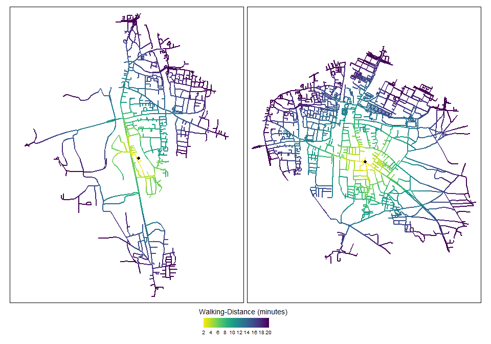

<!-- README.md is generated from README.Rmd. Please edit that file -->

# DRI-GLUCoSE

<!-- badges: start -->

<!-- badges: end -->

As elaborated in our recent analyses (Walker et al. 2019; Scarpone et
al. 2020), nearly all previous studies in the literature use either
census unit boundaries or simple buffer zones to measure an individual’s
built environment (BE) exposures or to characterize their local
socioeconomic status (SES) (Rhew et al. 2011, Gong et al. 2014, Fuertes
et al. 2014). Therefore, we present a distance-weighted, network-based
model for quantifying the combined effects of local greenspace and SES
on diabetes risk, from which we derive an area-based Diabetes Risk Index
of Greenspace, Land Use and Socioeconomic Environments (DRI-GLUCoSE).  
The goal of the DRIGLUCoSE package is to provide a public package
containing functions and code used in the development of the DRI-GLUCoSE
Index.

## Installation

You can install the latest version of DRIGLUCoSE from
[GitHub](https://CRAN.R-project.org) with:

``` r
devtools::install_git("https://github.com/STBrinkmann/DRIGLUCoSE")
```

## Usage

Once installed, the library can be loaded as follows:

``` r
library(DRIGLUCoSE)
```

# Methods

One key purpose of this package is, to provide functions for route
networked derived isochrones. For that purpose we have provided a simple
sf object of 2 points in Erlangen, Germany.

``` r
data(Erlangen)
Erlangen
#> Simple feature collection with 2 features and 2 fields
#> geometry type:  POINT
#> dimension:      XY
#> bbox:           xmin: 35199.46 ymin: -159433.5 xmax: 36281.59 ymax: -159243.2
#> projected CRS:  ETRS89 / LCC Germany (N-E)
#> # A tibble: 2 x 3
#>     tag Speed                 geom
#>   <dbl> <dbl>          <POINT [m]>
#> 1     1  78.5 (35199.46 -159433.5)
#> 2     2  79.8 (36281.59 -159243.2)
```

## Census variables

In our analysis we acquired data of the Canadian census dissemination
areas (DA, the smallest available census area with an average population
of 400-800 residents) for the census year 2006 from the federal
government agency Statistics Canada. It has been converted to a
shapefile (sf) with one column per census variable. To demonstrate we
use the following randomly generated data:

``` r
set.seed(1234)
census <- sf::st_make_grid(
  # Use Sample Data and apply 25 minutes buffer (Speed[m/min] * 25[min]) 
  Erlangen %>% dplyr::mutate(geom = sf::st_buffer(geom, Speed*25)),
  cellsize = 100
  ) %>% 
  st_as_sf() %>% 
  mutate(census_var = sample(1000:10000, n(), replace = TRUE)) %>% 
  rename(geom = x)

census
#> Simple feature collection with 2142 features and 1 field
#> geometry type:  POLYGON
#> dimension:      XY
#> bbox:           xmin: 33236.96 ymin: -161396 xmax: 38336.96 ymax: -157196
#> projected CRS:  ETRS89 / LCC Germany (N-E)
#> First 10 features:
#>    census_var                           geom
#> 1        8451 POLYGON ((33236.96 -161396,...
#> 2        9015 POLYGON ((33336.96 -161396,...
#> 3        8161 POLYGON ((33436.96 -161396,...
#> 4        9085 POLYGON ((33536.96 -161396,...
#> 5        8268 POLYGON ((33636.96 -161396,...
#> 6        1622 POLYGON ((33736.96 -161396,...
#> 7        1933 POLYGON ((33836.96 -161396,...
#> 8        3947 POLYGON ((33936.96 -161396,...
#> 9        3145 POLYGON ((34036.96 -161396,...
#> 10       3773 POLYGON ((34136.96 -161396,...
```

## Greenspace

In our analysis we acquired LANDSAT images through the United States
Geological Survey’s EarthExplorer platform
(<https://earthexplorer.usgs.gov/>). The Normalized Difference
Vegetation Index (NDVI) is used as a metric to model greenspace
exposure. Pre-processing of the LANDSAT images and NDVI calculation has
been conducted using the *LS\_L1C* function:

``` r
DRIGLUCoSE::LS_L1C(l1c_path = "docs/LC08_L1TP_193026_20200423_20200508_01_T1_small/", 
                   out_dir = "docs/LS_PreProcessed",
                   # Use Sample Data and apply 25 minutes buffer (Speed[m/min] * 25[min]) 
                   sf_mask = DRIGLUCoSE::Erlangen %>% 
                     dplyr::mutate(geom = sf::st_buffer(geom, Speed*25)),
                   cores = 20)
#> Project raster
#> DN to TOA Reflectance
#> class      : RasterStack 
#> dimensions : 122, 151, 18422, 8  (nrow, ncol, ncell, nlayers)
#> resolution : 30, 30  (x, y)
#> extent     : 33493.69, 38023.69, -161164.2, -157504.2  (xmin, xmax, ymin, ymax)
#> crs        : +proj=lcc +lat_0=51 +lon_0=10.5 +lat_1=48.6666666666667 +lat_2=53.6666666666667 +x_0=0 +y_0=0 +ellps=GRS80 +units=m +no_defs 
#> names      :      Blue,     Green,       Red,       NIR,     SWIR1,     SWIR2,      NDWI,      NDVI 
#> min values :         0,         0,         0,         0,         0,         0,        -1,        -1 
#> max values : 0.2020575, 0.2322532, 0.3076383, 0.5424371, 0.4233773, 0.3753066, 1.0000000, 1.0000000
```

## Exposure Model

In order to estimate each participant’s potential exposures to
greenspace and local SES, we (i) mapped age- and sex-specific walkable
zones around their residential address, and (ii) applied a negative
logit weighting function, such that the estimated effect of greenspace
or SES decreases as distance from the home increases.

### (i) Road network data and isochrones

In order to compute network-based distance metrics, we acquired street
data from OpenStreetMap using the R-package osmdata (Padgham et
al. 2017). Road types not suitable for walking were removed (e.g.,
motorways). Network data were topologically corrected and split into
\~30 metre-long segments using the R package *nngeo* (Dorman 2020).

``` r
erlangen.osm <- DRIGLUCoSE::osm_roads(x = Erlangen, dist = 20, 
                                      speed = "Speed", cores = 2)
erlangen.osm
#> Simple feature collection with 14302 features and 1 field
#> geometry type:  LINESTRING
#> dimension:      XY
#> bbox:           xmin: 32165.93 ymin: -162084.9 xmax: 38358.49 ymax: -157095
#> projected CRS:  ETRS89 / LCC Germany (N-E)
#> First 10 features:
#>         highway                           geom
#> 1.1.1  tertiary LINESTRING (34087.99 -15828...
#> 1.1.2  tertiary LINESTRING (34090.6 -158266...
#> 1.1.3  tertiary LINESTRING (34093.22 -15825...
#> 1.1.4  tertiary LINESTRING (34097.83 -15823...
#> 1.1.5  tertiary LINESTRING (34099.78 -15823...
#> 1.1.6  tertiary LINESTRING (34107.87 -15821...
#> 1.1.7  tertiary LINESTRING (34115.54 -15820...
#> 1.1.8  tertiary LINESTRING (34124.58 -15819...
#> 1.1.9  tertiary LINESTRING (34133.9 -158191...
#> 1.1.10 tertiary LINESTRING (34142.74 -15818...
```

This network data was used to derive walking distance buffers for each
participant, based on age- and sex-specific walking speed estimates
derived from the literature (Dewulf 2012). Starting from each
participant’s place of residence, we computed network-constrained
buffers with an off-road width of 40 meters, running in 2-minute
increments from 0 to 20 minutes, using the A\*-algorithm (Hart, Nilsson
& Raphael 1968). This therefore resulted in each participant having ten
concentric isochrones, the sizes of which are a function of participant
age and sex.  
Since the road network contains a lot of features (n=14292), this will
take some time (\~15-30 minutes).  
Figure 1 shows isodistances of the two points of the sample data in
Erlangen, Germany.

``` r
erlangen.isodistances <- DRIGLUCoSE::isodistances(x = Erlangen, 
                                                  road_network = erlangen.osm, 
                                                  tag = "tag", speed = "Speed",
                                                  isochrones_seq = seq(2, 20, 2),
                                                  cores = 2)
```

``` r
erlangen.isochrones <- DRIGLUCoSE::isochrones(x = erlangen.isodistances, 
                                              buffer = 40, cores = 2)
```



## (ii) Distance-weighting

In order to account for the diminishing effect of SES and greenspace
exposure as distance increases, we fitted a logit function to weight
each incremental isochrone, such that the influence of a variable
decreases with increasing distance from the household, i.e., features
that are farther away have less influence than nearby features, as
illustrated in Figure 2. A logit function was selected as it
heuristically approximates a suitable distance-decay function (Bauer and
Groneberg 2016; Jia et al. 2019) and various parameterisations
(parameters  and
) of the logit function
were assessed using sensitivity analysis.  
The distance-weighting is separated in two parts, first the logit
function (1) that is used for both SES and greenspace variables, and
second the proportional weights function (4) that is only applied on SES
variables.

  
dr}{\\int_0^{r_{t_{max}}} \\, g(r)dr}, t=1\\\\
      \\cfrac{\\int_{r_{t-1}}^{r_t}  \\, g(r)dr}{\\int_0^{r_{t_{max}}} \\, g(r)dr}, t\>1
    \\end{cases}
    && \\text{(1)}
\\end{align*}
")  

Each isochrone  is
assigned a distance weight
, calculated as
the integral of the logistic distance decay function
") (2)

  
 =
    \\cfrac{1}{1 + e^{ \\,b \\,(r-m)}}
    && \\text{(2)}
\\end{align*}
")  

with 
and , in the interval between the mean inner radius

and mean outer radius  of the isochrone (e.g. 2 to 4 minutes isochrones), normalized by
the integral from 0 to the outermost isochrone boundary
 (e.g. 20 minutes isochrone). Weighted summary statistics
like the mean NDVI to describe the greenspace are thus described as (3)

  

    && \\text{(3)}
\\end{align*}
")  

For SES variable the proportional weights of the census areas within the
isochrone are further defined as (4)

  
}
    {A(I_t)}
    && \\text{(4)}
\\end{align*}
")  

with the proportion of the area of the intersection of the census area
 and the
isochrone , and
the area of the isochrone
. The weighted
value of the SES variable
 in the census
area  is then defined as
(5)

  

    && \\text{(5)}
\\end{align*}
")  

Figure 2 visualizes the different submodels used for distance-weighting
SES and greenspace. Fig. 2a shows the unweighted values of a SES
variable and fig. 2b has been calculated using (5), thus representing
the proportional weights of all intersections with the census areas and
isochrones. Greenspace is weighted as shown in fig. 2c using (3).

<div class="figure">


<p class="caption">

Figure 2: Unweighted values (a) and network-based distance-weighting
function for socioeconomic variables (b) and greenspace (c). Bold black
lines indicate the isochrones.

</p>

</div>

  
  
The distance-weighting for the LANDSAT derived NDVI raster (greenspace
exposure) is handled using *LS\_band\_weighting*, and SES distance- and
areal-weighting using *census\_weighting*.

``` r
# Calculate sd, median, 5th percentile, 95th percentile and skew of NDVI values
NDVI_weighted <- 
  DRIGLUCoSE::LS_band_weighting(isochrones = erlangen.isochrones, tag = "tag",
                                landsat_list = dir("docs/LS_PreProcessed",
                                                   pattern = ".grd",
                                                   full.names = T) %>%
                                  lapply(raster::brick),
                                stats = list("sd", "median", 
                                             list("percentile", 0.05), 
                                             list("percentile", 0.95),
                                             "skew"), 
                                b = 8, m = 0.6, cores = 2) 

NDVI_weighted
```

    #> # A tibble: 2 x 6
    #>     tag    sd medain X5_percentile X95_percentile   skew
    #>   <dbl> <dbl>  <dbl>         <dbl>          <dbl>  <dbl>
    #> 1     1 0.205  0.597         0.259          0.905 -0.136
    #> 2     2 0.132  0.558         0.336          0.772 -0.215

``` r
census_weighted <- DRIGLUCoSE::census_weighting(isochrones = erlangen.isochrones, 
                                                tag = "tag", census = census, 
                                                b = 8, m = 0.6, cores = 2)
census_weighted
```

    #> # A tibble: 2 x 2
    #>     tag census_var
    #>   <dbl>      <dbl>
    #> 1     1       5374
    #> 2     2       5535
